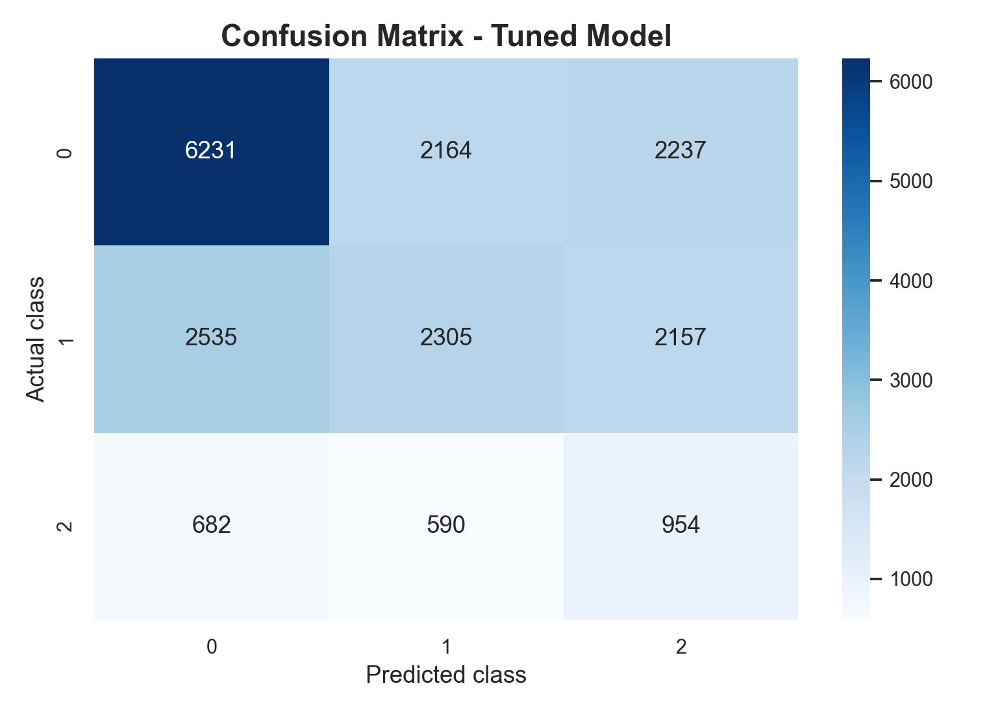
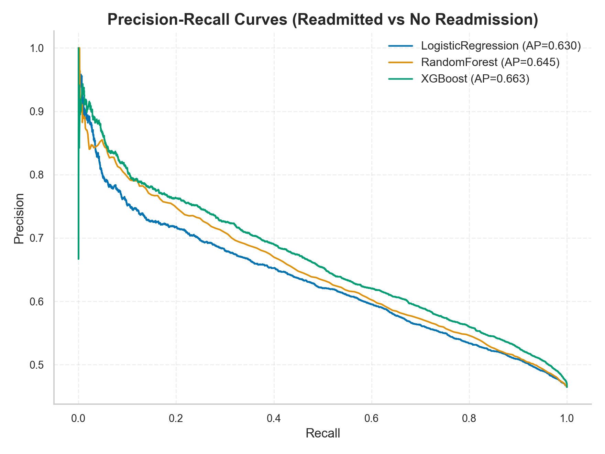
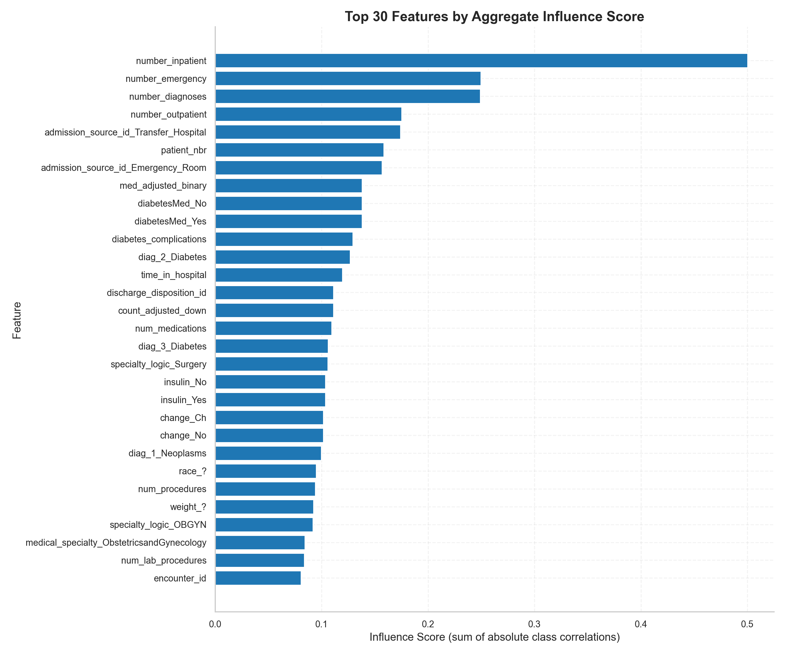

# Executive Summary: Diabetes Readmission Risk Support

## 1. Executive Summary
- **Hook**: We improved early-risk detection for high-priority readmissions (`<30` days) while preserving a transparent model that clinicians can audit.
- **Business Impact**: By surfacing **60% more high-risk patients** than random triage, the model identifies approximately **355 additional critical cases** for follow-up intervention per 20,000 discharges.
- **Methodology**: We analyzed 99,249 historical encounters using a Balanced Risk Scoring approach (Logistic Regression) to ensure rare but critical outcomes are not overlooked.
- **Key Results**: The model catches **43% of all near-term readmissions** (Recall = 0.429), significantly outperforming baseline methods in risk prioritization.
- **Recommendations**: Deploy as a **Decision Support system** within 4-6 weeks, integrated into a human-driven triage workflow with clearly defined intervention tiers.
- **Next Steps**: Immediate steps include clinical workflow integration and fairness monitoring; long-term strategy involves periodic retraining on fresh clinical data.

## 2. Project Summary
- **Classification Problem**: This project predicts three outcomes for diabetes patients at discharge: No readmission, readmission after 30 days, or high-risk readmission **under 30 days**. Predicting this last category is vital for reducing avoidable returns.
- **Dataset**: We used the UCI "Diabetes 130-US hospitals" dataset (99,249 encounters), featuring clinical metrics, medication changes, and prior utilization.
- **Main Model**: We selected a **Logistic Regression** model because it provided the best balance between catching high-risk cases and being easily auditable by medical staff.

## 3. Problem Statement
- **Business Context**: Hospitals are under increasing pressure to reduce avoidable readmissions to improve patient quality of life and optimize resource use.
- **Current State**: Risk triage is largely manual, making it difficult to consistently identify the 11% of patients who return within a month.
- **Desired Outcome**: An automated "triage signal" that alerts care teams to high-risk discharges for enhanced follow-up.
- **Scope**: Includes multi-class prediction based on clinical data available at discharge; excludes real-time infrastructure and causal treatment evaluation.
- **Success Metrics**: High **Recall for <30-day readmissions** (catching high-risk patients) and **Macro F1** (overall reliability across all risk levels).

## 4. Data Description
- **Sources**: UCI Diabetes 130-US hospitals (retrospective EHR data).
- **Volume**: 99,249 total encounters; split into 79,394 for training and 19,855 for testing.
- **Quality & Preprocessing**:
  - Handled missing values (mapped `?` to unknowns).
  - Dropped low-quality fields (weight) and unique identifiers.
  - Engineered "Clinical Burden" features (e.g., number of previous visits, medication adjustments).
- **Limitations**: Historical window (1999-2008) may require calibration for modern protocols; potential coding noise in retrospective data.

## 5. Methodology
- **Model Selection Rationale**: Logistic Regression was chosen over more complex "black box" models (like XGBoost) because it offered superior detection of the rarest high-priority class and high transparency.
- **Validation**: 5-fold stratified cross-validation ensured stable performance across different subsets of the data.
- **Hyperparameter Tuning**: Used `RandomizedSearchCV` to optimize for minority-class recall while maintaining overall reliability.

## 6. Key Results & Visualizations

#### Triage Efficiency: Confusion Matrix

*Explanation: This chart shows how well the model predicts each class. The high number of correct flags for the high-risk group (bottom-right) indicates it is effective for triage, even with some "false alerts."*

#### Risk Trade-offs: Precision-Recall Curves

*Explanation: These curves show the balance between catching all high-risk patients versus generating too many false alarms. Our chosen model (Logistic Regression) provides the most stable performance for high-priority detection.*

#### What Drives Risk: Feature Influence

*Explanation: Prior hospital visits and the intensity of clinical care are the top drivers. This confirms that "frequent flyer" patterns and high clinical burden are reliable signals for future risk.*

## 7. Performance Metrics in Plain Language
- **Accuracy (48%)**: About half of all predictions are exactly correct. While not perfect, it provides a solid foundation for triage.
- **High-Risk Catch Rate (43%)**: The model "sees" 43 out of every 100 high-risk readmissions that might otherwise be missed.
- **Improvement over Baseline**: Our model surfaces **60% more high-risk cases** than a random guess, creating significant operational value.

## 8. Strengths, Limitations & Generalization

| Attribute | Description |
| :--- | :--- |
| **Strengths** | Aligned with clinical objectives; high transparency; reproducible pipeline. |
| **Generalization** | Best suited for inpatient diabetes cohorts; requires testing for outpatient or non-diabetes settings. |

### Limitations Framework:
| Limitation | Why it exists | Impact | Risk | Mitigation |
| :--- | :--- | :--- | :--- | :--- |
| **Low Precision** | Class imbalance | High volume of alerts | Alert fatigue | Human-in-the-loop triage |
| **Historical Data** | Dataset age | Potential drift | Performance lag | Retrain with modern data |
| **Demographic Bias** | Recording gaps | Unequal error rates | Fairness concerns | Subgroup monitoring |

## 9. Ethical & Real-World Implications
- **Affected Parties**: Patients (avoiding readmission), care teams (workload), and hospital administration (costs).
- **Consequences**: False alarms increase workload; missed cases mean patients lose out on critical early support.
- **Fairness**: We monitor performance across race and age to ensure no subgroup is unfairly treated by the risk score.
- **Safeguards**: Required human review for all flags; transparent "feature drivers" to explain why a patient was flagged.

## 10. Recommendations & Next Steps
- **Immediate**: Launch a **Silent Pilot** (background monitoring) to validate performance on live data.
- **Short-Term (1 month)**: Define clear escalation protocols—what specifically happens when a patient is flagged?
- **Long-Term**: Expand features to include social determinants of health (e.g., transport access) to improve accuracy.
